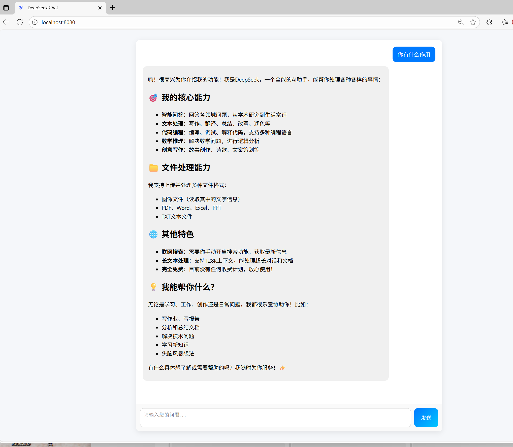

📖 项目简介

Deepseek WebChat 是一个基于 Spring Boot + HTML/JS 前端 的简易聊天系统，
通过调用 Deepseek API 实现实时流式对话功能。
项目内置后端代理，解决跨域问题，前端页面启动后即可直接与模型对话。

⚙️ 技术栈

后端：Spring Boot + WebFlux + Maven

前端：HTML + JavaScript + Markdown + Highlight.js

接口来源：Deepseek API（支持流式输出）

🚀 启动步骤
1️⃣ 克隆项目
git clone https://github.com/MTQ851/deepseek-webchat.git
cd deepseek-webchat

2️⃣ 修改 API Key

打开 src/main/java/com/deepseek/controller/ai/DeepSeekController.java，
找到以下行并替换成你自己的 Deepseek Key：

private static final String DEEP_SEEK_API_KEY = "Bearer sk-xxxxxxxxxxxxxxxx";

3️⃣ 启动后端

确保你已安装 Maven（mvn -v 可检查），然后在项目根目录执行：

mvn clean package
mvn spring-boot:run

默认会在 http://localhost:8080/
启动服务。

4️⃣ 访问前端

浏览器打开：

http://localhost:8080/index.html

即可进入聊天界面。

📁 项目结构
deepseek-webchat/
├── src/
│   ├── main/
│   │   ├── java/com/deepseek/controller/ai/DeepSeekController.java  # 核心接口
│   │   ├── resources/static/index.html                               # 前端页面
│   │   └── resources/application.yml                                 # 配置文件
├── pom.xml
└── README.md

📜 许可证

本项目基于 MIT License 开源，欢迎二次开发与学习使用。

